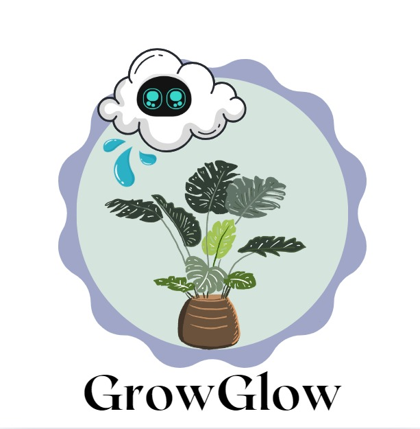

# GrowGlow

## Identidad gráfica

### Logo proyecto actual

#### Logo del equipo / empresa

## Descripción del proyecto 

** GrowGlow ** involucra una maceta inteligente diseñada para optimizar el cuidado de las plantas, específicamente flores claveles, en macetas en casa. Es un sistema IoT creado para facilitar la gestión y monitoreo de las condiciones del suelo en plantas de clavel. A través de sensores inteligentes, se optimizan los procesos de riego y manejo del suelo. Este sistema se visualiza y controla mediante una aplicación web que muestra en tiempo real el estado de la planta.

## Problematica

Muchas personas que desean tener un clavel en casa no cuentan con el conocimiento necesario para asegurar que la planta reciba el cuidado adecuado, especialmente cuando se trata de controlar factores como la humedad, luz y temperatura del suelo. Esto puede resultar en un clavel marchito o muerto debido a un riego incorrecto o condiciones inadecuadas. 

## Propuesta de solución

Se propone un sistema IoT inteligente que permita monitorear en tiempo real las condiciones del suelo y el ambiente, específicamente diseñado para el clavel, optimizando el riego y el cuidado de la planta. Este sistema simplifica el proceso de cuidado, garantizando un ambiente saludable para el clavel mediante la medición constante de humedad, temperatura y luz.

## Objetivo general

Desarrollar e implementar un sistema IoT inteligente para el monitoreo en tiempo real de las condiciones del suelo y el ambiente de un clavel en casa, con el fin de optimizar el riego y el manejo de las condiciones ambientales, facilitando el cuidado de la planta, mejorando su salud y prolongando su vida.

## Objetivos específicos

 
 
#### 1 Diseñar y desarrollar un sistema de sensores IoT
- Medir de manera precisa los niveles de humedad del suelo específicos para el clavel.
- Medir la intensidad de la luz ambiental ideal para el clavel.
- Medir la temperatura del suelo adaptados a las necesidades del clavel.

#### 2 Implementar un sistema de riego automatizado
- Activar el riego automáticamente cuando los niveles de humedad del suelo caigan por debajo de un umbral específico para el clavel.

#### 3 Crear una plataforma de visualización y alertas
- Desarrollar una aplicación web donde los usuarios puedan monitorear el estado de su clavel en tiempo real.

#### 4 Optimizar el uso de recursos
- PAsegurar un uso eficiente de agua y fertilizantes mediante el monitoreo y las recomendaciones basadas en datos precisos.

#### 5 Mejorar la Experiencia del Usuario
- Diseñar una interfaz intuitiva para que los usuarios, incluso sin experiencia en jardinería, puedan cuidar adecuadamente de su clavel.

## Modelo canvas

## Tabla de colaboradores

|Integrante|Contacto|Rol|
|------------|--------|---|
|Michelle Castro Otero |[@Ktmich2095](https://github.com/Ktmich2095)|Líder del equipo / Desarrollado BackEnd|
|Sayurid Bautista Cruz|[@sayuridbc](https://github.com/sayuridbc)|  Desarrollador FrontEnd |
|Luis Daniel Suárez Escamilla |[@Danny88e](https://github.com/Danny88e)| Desarrollador en Base de Datos|
|Uriel Maldonado Bernabé |[@Urii7895](https://github.com/Urii7895)| Responsable en IoT |
|Daniel García Pluma |[@DanielGarciaPluma](https://github.com/DanielGarciaPluma)| Desarrollador en Documentación |

